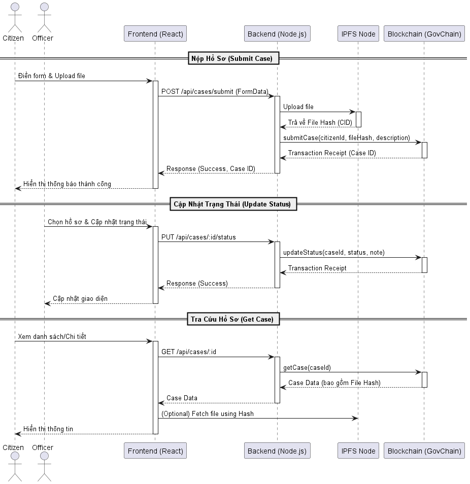
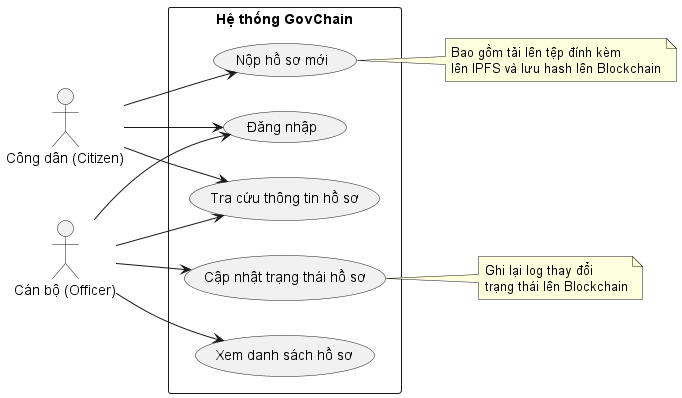

# GovChain Demo

GovChain Demo là một ứng dụng phi tập trung (DApp) minh họa quy trình quản lý hồ sơ dịch vụ công trên nền tảng Blockchain.

## 📑 Mục Lục

- [GovChain Demo](#govchain-demo)
  - [📑 Mục Lục](#-mục-lục)
- [Phần 1: Hướng dẫn cài đặt và chạy dự án](#phần-1-hướng-dẫn-cài-đặt-và-chạy-dự-án)
    - [Yêu cầu tiên quyết](#yêu-cầu-tiên-quyết)
    - [1. Cài đặt IPFS (InterPlanetary File System)](#1-cài-đặt-ipfs-interplanetary-file-system)
    - [2. Khởi chạy mạng Blockchain cục bộ (Hardhat)](#2-khởi-chạy-mạng-blockchain-cục-bộ-hardhat)
    - [3. Triển khai Smart Contract](#3-triển-khai-smart-contract)
    - [4. Khởi chạy Backend Server](#4-khởi-chạy-backend-server)
    - [5. Khởi chạy Frontend](#5-khởi-chạy-frontend)
- [Phần 2: Thông tin dự án](#phần-2-thông-tin-dự-án)
  - [Kiến trúc hệ thống](#kiến-trúc-hệ-thống)
  - [Biểu đồ tuần tự (Sequence Diagram)](#biểu-đồ-tuần-tự-sequence-diagram)
  - [Biểu đồ ca sử dụng (Use Case Diagram)](#biểu-đồ-ca-sử-dụng-use-case-diagram)

---

# Phần 1: Hướng dẫn cài đặt và chạy dự án

### Yêu cầu tiên quyết

*   [Node.js](https://nodejs.org/) (v18+)
*   [Git](https://git-scm.com/)
*   [IPFS Desktop](https://docs.ipfs.tech/install/ipfs-desktop/) hoặc IPFS CLI

### 1. Cấu hình biến môi trường

Trước khi chạy dự án, bạn cần tạo các file cấu hình `.env` từ các file mẫu `.env.example`.

1.  **Backend:**
    ```bash
    cd backend
    cp .env.example .env
    ```
2.  **Frontend:**
    ```bash
    cd frontend
    cp .env.example .env
    ```
3.  **Hardhat:**
    ```bash
    cd hardhat2
    cp .env.example .env
    ```

### 2. Cài đặt IPFS (InterPlanetary File System)

Dự án sử dụng IPFS để lưu trữ các tệp đính kèm của hồ sơ một cách phi tập trung.

1.  Tải và cài đặt **IPFS Desktop** từ [đây](https://github.com/ipfs/ipfs-desktop/releases).
2.  Mở ứng dụng IPFS Desktop.
3.  Đảm bảo trạng thái là **Connected** (Đã kết nối).
4.  IPFS API thường chạy mặc định tại cổng `5001`. Backend sẽ kết nối tới `http://127.0.0.1:5001`.

### 3. Khởi chạy Blockchain và Triển khai Contract

Chúng tôi cung cấp script tự động để khởi chạy mạng local và triển khai contract.

1.  Mở terminal tại thư mục `hardhat2`.
2.  Chạy file `start_demo.bat` (trên Windows):
    ```bash
    cd hardhat2
    start_demo.bat
    ```
    *Script này sẽ mở một cửa sổ mới chạy Hardhat Node, sau đó tự động deploy contract và seed dữ liệu mẫu.*

3.  **Quan trọng:** Sau khi script chạy xong, hãy tìm dòng thông báo tương tự như sau trong terminal:
    ```
    ✅ GovChain deployed to: 0x5FbDB2315678afecb367f032d93F642f64180aa3
    ```
4.  Copy địa chỉ contract này (ví dụ: `0x5FbDB...`).

### 4. Cập nhật cấu hình Backend

1.  Mở file `backend/.env`.
2.  Dán địa chỉ contract vừa copy vào biến `CONTRACT_ADDRESS`:
    ```dotenv
    CONTRACT_ADDRESS=0x5FbDB2315678afecb367f032d93F642f64180aa3
    ```
3.  Lưu file.

### 5. Khởi chạy Backend Server

Mở một terminal mới:

```bash
cd backend
npm install
# Server sẽ chạy tại http://localhost:3000
npm run dev
```

### 6. Khởi chạy Frontend

Mở một terminal mới:

```bash
cd frontend
npm install
# App sẽ chạy tại http://localhost:5173
npm run dev
```

---

# Phần 2: Thông tin dự án

## Kiến trúc hệ thống

Hệ thống GovChain được thiết kế theo mô hình 3 tầng kết hợp với Blockchain và IPFS:

1.  **Frontend (Presentation Layer):**
    *   Xây dựng bằng **ReactJS** và **Vite**.
    *   Cung cấp giao diện cho Công dân (nộp hồ sơ, tra cứu) và Cán bộ (xử lý hồ sơ).
    *   Giao tiếp với Backend thông qua RESTful API.

2.  **Backend (Application Layer):**
    *   Xây dựng bằng **Node.js**, **Express**, **TypeScript**.
    *   Đóng vai trò là cầu nối (Middleware) giữa người dùng và Blockchain.
    *   Xử lý logic nghiệp vụ, xác thực người dùng.
    *   Tương tác với IPFS để upload file.
    *   Tương tác với Smart Contract thông qua thư viện **Ethers.js**.

3.  **Blockchain & Storage Layer:**
    *   **GovChain (Smart Contract):** Viết bằng **Solidity**, chạy trên mạng **Hardhat** (mô phỏng Ethereum). Lưu trữ trạng thái hồ sơ, mã định danh công dân, và mã băm (Hash) của file. Đảm bảo tính toàn vẹn và không thể chối bỏ.
    *   **IPFS:** Lưu trữ nội dung chi tiết của tệp hồ sơ. Chỉ có mã băm (CID) được lưu trên Blockchain để tối ưu chi phí.

## Biểu đồ tuần tự (Sequence Diagram)

Dưới đây là luồng xử lý chính của hệ thống khi nộp hồ sơ và cập nhật trạng thái.



## Biểu đồ ca sử dụng (Use Case Diagram)

Mô tả các chức năng chính của các tác nhân trong hệ thống.



